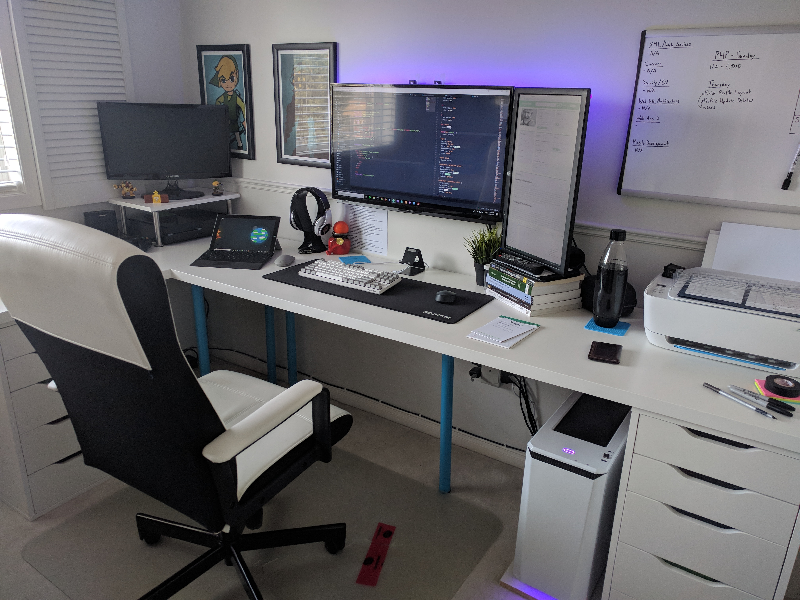

Front-end free-for-all is my personal outlet along my development journey. I created this blog to write about the new technologies I'm learning, cool and useful tips for newer developers, and mostly to combine my two biggest passions, technology and writing.

My name is Matt and in the summer of 2017 I decided to make a complete 180 degree turn in my life. I had already done my time in university, collecting a degree in History and Sociology, spending more time partying and playing video games than in class. When it came to to find a big boy job nothing really appeased me and I spent the better part of two years at disinterseting jobs, twiddling my thumbs until quitting time. 

During that summer I started to play around with HTML and CSS, having never even seen a line of code before it was a great place to get my hands dirty in something that was low-level and extremly cool to boot. I've always loved design, I did a lot of graphic design work for my parents small business growing up and had the opportunity to have Photoshop to play with growing up. I also love building, working with my hands and being able to create something, having something to hold on to and say 'I built this'. 

Web development was the perfect outlet for my spare time and I decided (with the help of my significant other) that I would go back to school and create a career of my new pastime. I hope that you can gain something from my posts, if you use my code or learn anything please let me know with a comment! 

Cheers,
Matt

Check out my personal <a href="https://www.mattmawhinney.com">site</a>.